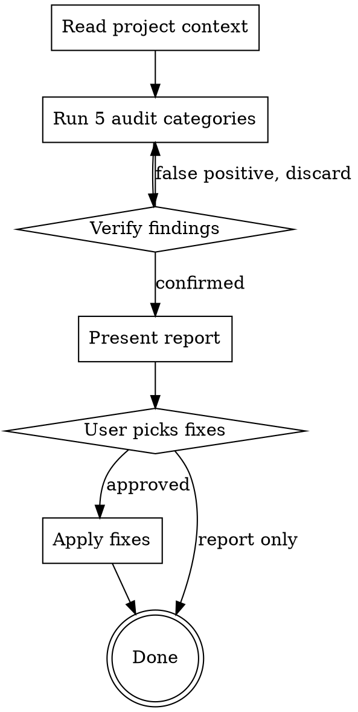

# Code Maintenance Audit

Structured audit of a Go codebase across five categories. Produces a findings report; fixes only on user approval.

## Scope Boundaries

**In scope:** consistency, documentation, dead code/cruft, dependency hygiene, code simplification.

**Out of scope — these have their own skills:**
- Performance optimization
- Security audit
- Test coverage / test quality
- Architecture review
- Pre-merge code review

If you find a performance or security issue during the audit, note it briefly under a separate "Out of Scope Observations" section — do NOT mix it into the main categories.

## Process



### Scoping

For large codebases or limited budgets, run categories incrementally: complete 1-2 categories, present findings, then continue if budget allows. Categories are independent — partial reports are fine.

### Step 1: Read Project Context

Read CLAUDE.md, go.mod, and top-level directory listing (`ls` — not deep recursion). Understand:
- What conventions the project already declares
- What linters/tools are configured (check Makefile for lint targets)
- What the project considers hot path vs cold path

Do NOT skip this. Every finding must be evaluated against the project's own standards, not generic Go conventions.

### Step 2: Run Five Audit Categories

Run each category using the tools specified. Do NOT grep randomly — use the right tool for the job.

#### Category 1: Consistency

Check whether the codebase follows its own patterns consistently.

**What to check:**
- Error handling patterns — does the project wrap errors consistently? `fmt.Errorf("context: %w", err)` vs bare `return err`
- Logging patterns — structured logging vs fmt.Sprintf, logger injection vs package-level
- Interface usage — are interfaces defined where used (consumer side) or with the implementation?
- Package structure — do similar packages follow the same file organization?
- Naming — exported vs unexported, acronym casing (HTTP vs Http), receiver names

**Tools:** gopls (workspace symbols, references), codebase-memory-mcp (search_graph for pattern analysis), grep for specific patterns.

**Do NOT:** Flag things that are intentional project conventions. Read CLAUDE.md first.

#### Category 2: Documentation

Check that documentation matches current code.

**What to check:**
- Exported symbols missing godoc comments — use `golangci-lint run --enable=revive` or check exported funcs/types manually if linter not configured
- Reference docs in `docs/reference/` out of sync with CRD types in `api/v1alpha1/` — for each field in the Go type, verify it appears in the corresponding reference doc
- Env var cross-reference — grep docs for env var patterns (e.g., `[A-Z_]{3,}`), then verify each exists in code with `grep -r "ENV_NAME" --include="*.go"`
- README or guide references to flags, env vars, or APIs that no longer exist
- Stale code comments that describe behavior that changed

**Tools:** gopls (diagnostics), golangci-lint, grep for env var cross-referencing.

**Verification required:** For each "stale doc" finding, read BOTH the doc and the code to confirm the mismatch. Do not guess.

#### Category 3: Dead Code & Cruft

Find code that serves no purpose.

**What to check:**
- Unused exported functions (use codebase-memory-mcp: `search_graph` with `max_degree=0, direction=inbound, exclude_entry_points=true`)
- Stale TODOs — use `git log -1 --format=%ai` on TODO lines via `git blame` to check age; flag if >6 months old or referencing completed work
- Orphaned test helpers — helpers in `_test.go` files that nothing calls
- Unreferenced files — files not imported by anything

**Tools:** codebase-memory-mcp (dead code detection), gopls (unused symbols), `git blame -L` + `git log` for TODO age.

**Do NOT flag:**
- `.claude/` directory contents (tool artifacts, not project code)
- Generated files (check for `// Code generated` headers)
- Test fixtures or test server code unless truly orphaned

#### Category 4: Dependency Hygiene

Check that dependencies are current and clean.

**What to check:**
- `go mod tidy` — run and check if it produces a diff
- Outdated dependencies — `go list -m -u all` to find available updates
- Unused direct dependencies — dependencies in `require` not imported anywhere
- Known vulnerabilities — `govulncheck ./...` if available

**How to run:**
- `go mod tidy` dry run: `cp go.sum go.sum.bak && go mod tidy && diff go.sum go.sum.bak; mv go.sum.bak go.sum` (restore after)
- `go list -m -u all 2>/dev/null | grep '\[' ` — shows deps with available updates
- `govulncheck ./...` — only if installed; skip gracefully if not

**Do NOT:** Recommend upgrading major versions without noting breaking change risk.

#### Category 5: Code Simplification Candidates

Find code that is more complex than it needs to be.

**What to check:**
- Functions over 50 lines — candidates for extraction
- High fan-out functions — use codebase-memory-mcp: `search_graph` with `min_degree=10, direction=outbound, relationship=CALLS`
- Deeply nested logic (3+ levels of indentation)
- Duplicated logic across files

**Tools:** codebase-memory-mcp (fan-out analysis), grep for structural patterns.

**Do NOT:** Suggest simplification for code the project explicitly marks as performance-critical.

### Step 3: Verify Findings

Before including ANY finding in the report:

1. **Read the actual code** at the location you're reporting. Do not report based on grep output alone.
2. **Check if it's intentional** — does CLAUDE.md, a comment, or the project structure explain why it's this way?
3. **Confirm accuracy** — if you say "function X is unused", verify with both codebase-memory-mcp AND gopls.

False positives destroy trust in the report. One wrong finding makes the user question everything.

### Step 4: Present Report

Format:

```
## Code Maintenance Report — [project name]

### Summary
- X findings across 5 categories
- Top 3 recommended actions

### Category 1: Consistency
**[HIGH/MEDIUM/LOW] Finding title**
- Location: `file/path.go:123`
- Issue: what's wrong
- Recommendation: what to do

### Category 2: Documentation
...

### Out of Scope Observations
(Performance/security issues noticed but not in scope)
```

**Severity guide:**
- **HIGH** — actively causes confusion, bugs, or blocks contributors
- **MEDIUM** — makes the codebase harder to maintain over time
- **LOW** — cosmetic or minor improvement

End the report with a "Top 3 Actions" section — the three findings that would improve the codebase most per effort invested.

### Step 5: Fix on Approval

Only fix what the user explicitly approves. For each fix:
1. Make the change
2. Run `make lint` and `make test-unit` to verify no regressions
3. Do NOT commit — let the user review and commit

## Common Mistakes

| Mistake | Why it's wrong |
|---------|---------------|
| Reporting `.claude/` artifacts as cruft | These are tool-generated, not project code |
| Flagging generated code as inconsistent | Generated code follows its own rules |
| Saying "no deprecated deps" without running `go list -m -u` | You must actually check |
| Mixing performance issues into consistency | Performance has its own skill |
| Reporting a finding without reading the code | Grep matches lie — verify |
| Recommending major version upgrades casually | Breaking changes need explicit risk assessment |
| Inventing statistics ("667 Go files") | Count accurately or don't count |
